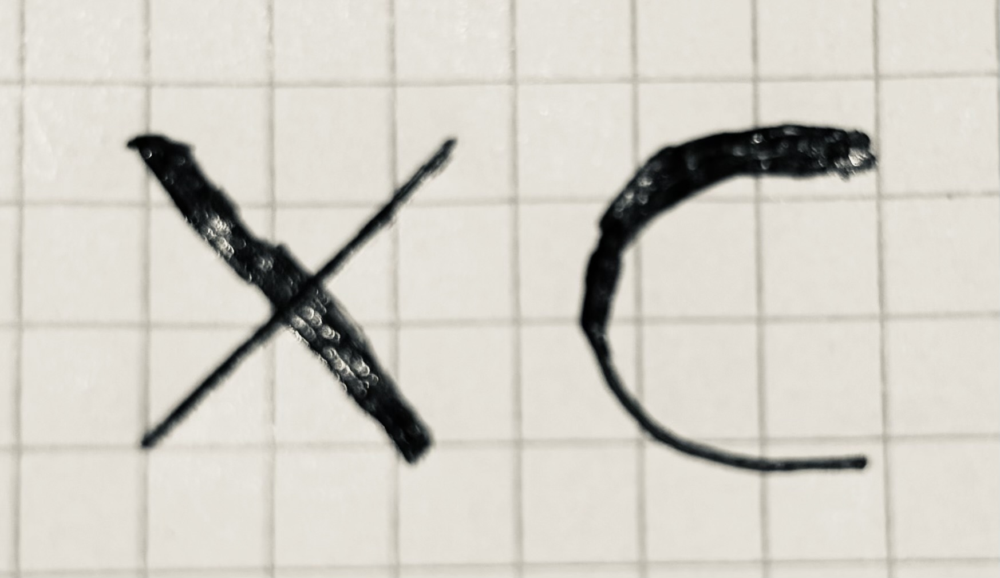

# C90 to RISC-V Assembly Compiler



This was a coursework from the "Instruction Architectures and Compilers" course
at Imperial College London.

It was developed in collaboration with [Orlan Forshaw](https://github.com/ManofRenown).

## Supported C90 Features

It features almost all of C90 but since this was developed within roughly 3 weeks
there are some omissions.
The following features are supported:

* variables of `int` type
* local variables
* arithmetic and logical expressions
* `if`-then-`else` statements
* `while` loops

* files containing multiple functions that call each other
* functions that take up to 8 parameters
* `for` loops
* arrays declared globally (i.e. outside of any function in your file)
* arrays declared locally (i.e. inside a function)
* array initialization
* reading and writing elements of an array (index can be a constant, a variable or an expression)
* recursive function calls
* the `enum` keyword
* `switch` statements
* the `break` and `continue` keywords

* variables of `double`, `float`, `char`, `unsigned`, structs, and pointer types
* calling externally-defined functions (i.e. the file being compiled declares a function, but its definition is provided in a different file that is linked in later on)
* functions that take more than 8 parameters
* mutually recursive function calls
* locally scoped variable declarations (e.g. a variable that is declared inside the body of a while loop, such as `while(...) { int x = ...; ... }`.
* the `typedef` keyword
* the `sizeof(...)` function (which takes either a type or a variable)
* taking the address of a variable using the `&` operator
* dereferencing a pointer-variable using the `*` operator
* pointer arithmetic
* character literals, including escape sequences like `\n`
* strings (as NULL-terminated character arrays)
* declaration and use of structs

Not yet supported:

* multithreading
* the `goto` keyword
* macros and other preprocessing directives
* the comma operator (for sequencing within expressions)
* the [old K&R style of declaring functions](https://stackoverflow.com/a/18820829)
* union types
* variable-length arrays (C90 forbids them)
* the `const` keyword
* function pointers
* both implicit and explicit casting
* the `extern` keyword (handling externally-defined functions is a part of the advanced features, but `extern` is not used for that)
* the `short` and `long` types (correct width handling is tested with `float` and `double`)
* the `void` type is not tested explicitly, but it appears in some helper functions in the test cases, so your compiler cannot break when it encounters this keyword
* the `static` keyword

## Usage

```
make bin/c_compiler
```

```
./bin/c_compiler -S test_program.c -o test_program.s
```

## Acknowledgements

* The coursework was originally designed by [David Thomas](https://www.southampton.ac.uk/people/5z9bmb/professor-david-thomas), who lectured this module until 2017-18. It is nowadays maintained by [John Wickerson](https://johnwickerson.github.io/), to whom any feedback should be sent.
* Thanks to [Yann Herklotz](https://yannherklotz.com/) for making various improvements to the compiler-testing scripts.
* Thanks to [Archie Crichton](https://www.doc.ic.ac.uk/~ac11018/) for providing a basic "getting started" compiler.
* Thanks to [James Nock](https://www.linkedin.com/in/jpnock) for overhauling the scripts for configuring the development environment, for writing detailed instructions for setting this up on various operating systems, and for creating GitHub actions capable of automatically testing compilers.
* Thanks to [Quentin Corradi](https://www.imperial.ac.uk/people/q.corradi22) for setting up coverage testing and writing a getting-started guide for that.
* Thanks to [Filip Wojcicki](https://www.linkedin.com/in/filip-wojcicki) for overhauling the coursework specification and providing a new getting-started guide.
